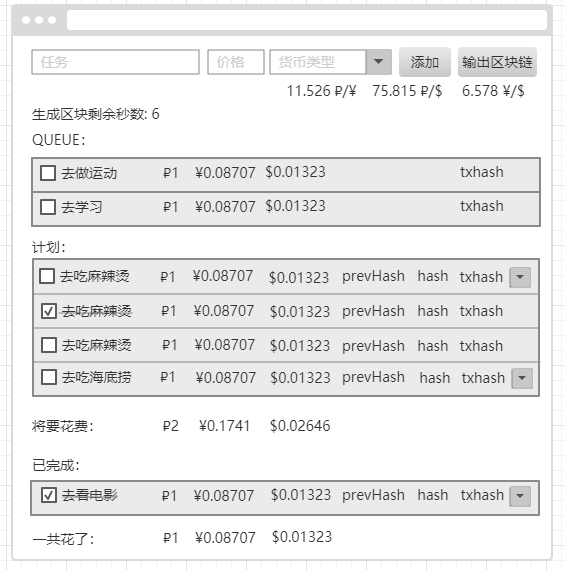

# 面试任务-进阶

## UI

(样式不必与此图一模一样，内容相同即可)

## 最终效果参考

[最终效果参考](https://qinwl.gitee.io/interview-task/)

## 任务描述

继上一个面试任务，做一个区块链，用来保存 todolist 的数据。

## 任务要求

1. 只需要实现区块链的基本结构，不需要做共识机制之类的
2. 区块链的数据结构不需要全按照标准来，可以自行增删修改标准中的数据结构，但需要能体现出区块的本质
3. 只需要实现一条链，这条链是保存在 js 变量中的，然后维护它
4. 设定每半分钟生成一个区块，一个区块最大可以存5条数据
5. 区块链的数据只能增加和查看，不能删除和修改

## 任务功能

1. 实现上一个任务 todolist 的所有功能，todolist 的数据使用区块链保存
2. 添加一个“输出区块链”按钮，点击后，可以在 console 中看到区块链的状态(直接将保存区块链的变量，console.log 出来即可)
3. 添加生成区块剩余秒数
4. 新增一个 QUEUE 表，用来展示还没上链的交易记录
5. 生成一个区块的时候，console 中输出一下这个区块
6. 每个 todo 项，添加以下内容
    - 添加 prevHash 标签，显示当前 todo 项所在区块的上一个区块的 hash
    - 添加 hash 标签，显示当前 todo 项所在区块的 hash
    - 添加 txhash 标签，显示当前 todo 项所在交易的 hash
    - 添加交易历史记录按钮，点击后，会下拉列表显示关于这个 todo 项的所有交易记录，例如 ui 图，点击了第一个 todo 项后，列出了2个以前的交易记录
